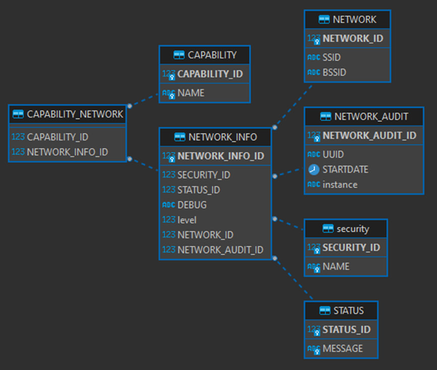

# json-to-firebird
University project. Simple program that converts JSON data to Java objects and then inserts it in the Firebird database.

# Sample data
Archive folder contains sample data

# Prerequisites
You should have installed and working Firebird database. Then you need to edit connection string in the JDBCConnection class.

# Table structure
You should create the following tables before converting:



<details>
  <summary>SQL</summary>

  ```SQL
  CREATE TABLE status (
    status_id integer NOT NULL PRIMARY KEY,
    message varchar(50) NOT NULL UNIQUE
  );

  CREATE TABLE "security" (
    security_id integer NOT NULL PRIMARY KEY,
    name varchar(20) NOT NULL UNIQUE
  );

  CREATE TABLE network (
    network_id integer NOT NULL PRIMARY KEY,
    ssid varchar(50) NOT NULL,
    bssid varchar(50) NOT NULL
  );

  CREATE TABLE network_audit (
    network_audit_id integer NOT NULL PRIMARY KEY,
    uuid varchar(36) NOT NULL,
    startDate timestamp NOT NULL,
    "instance" varchar(15)
  );

  CREATE TABLE network_info (
    network_info_id integer NOT NULL PRIMARY KEY,
    security_id integer NOT NULL REFERENCES "security",
    status_id integer NOT NULL REFERENCES status,
    debug varchar(5000),
    "level" integer NOT NULL,
    network_id integer NOT NULL REFERENCES network,
    network_audit_id integer NOT NULL REFERENCES network_audit
  );

  CREATE TABLE capability (
    capability_id integer NOT NULL PRIMARY KEY,
    name varchar(50) NOT NULL UNIQUE
  );

  CREATE TABLE capability_network (
    capability_id integer NOT NULL REFERENCES capability,
    network_info_id integer NOT NULL REFERENCES network_info
  );
  ```
</details>
